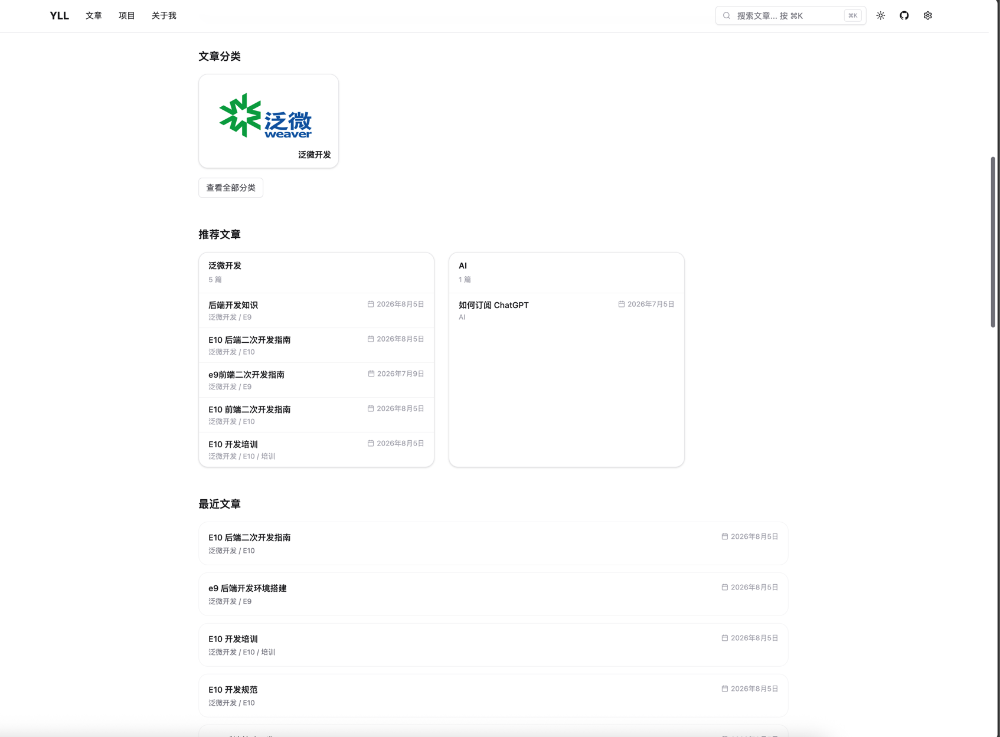
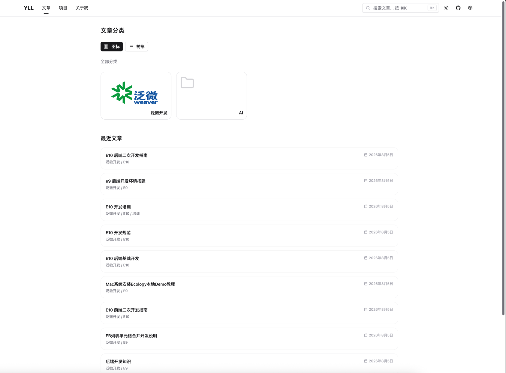
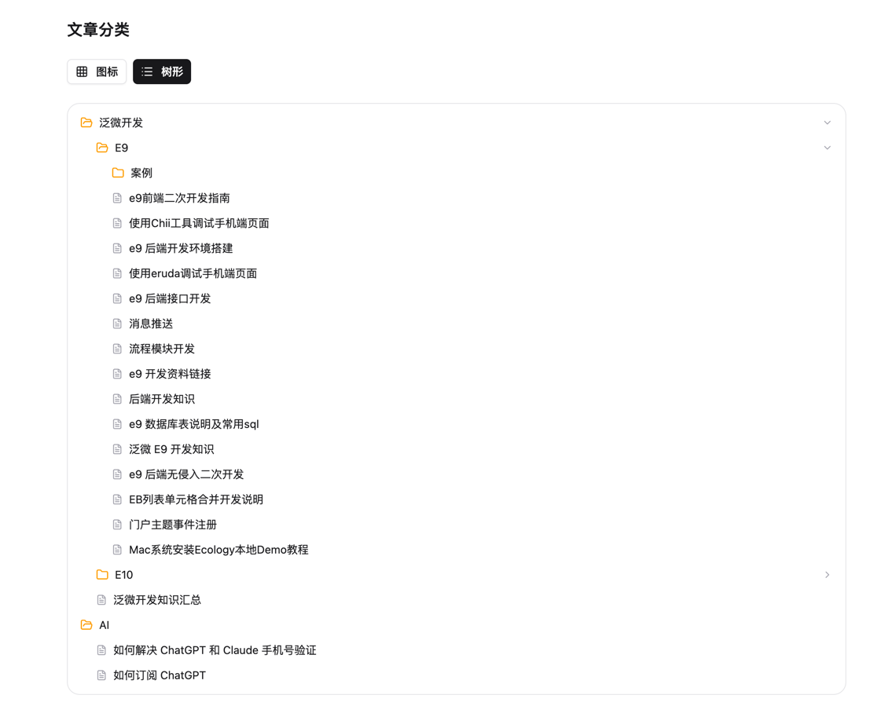
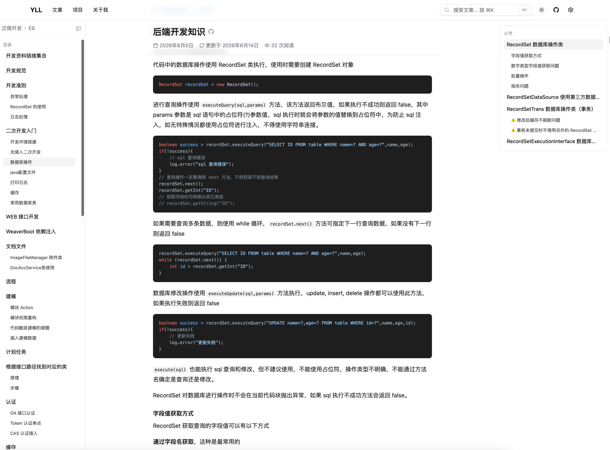
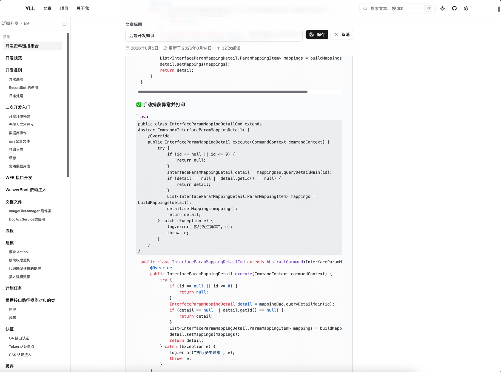
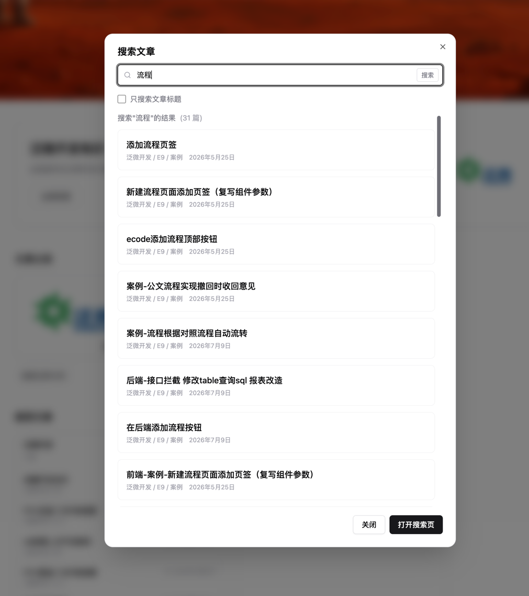
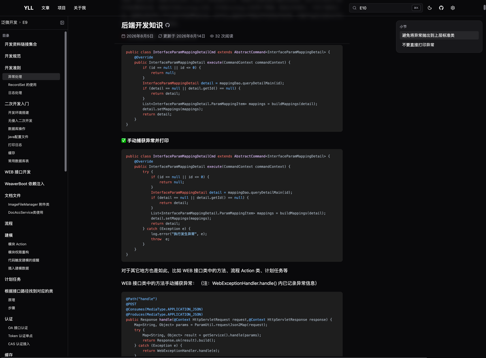
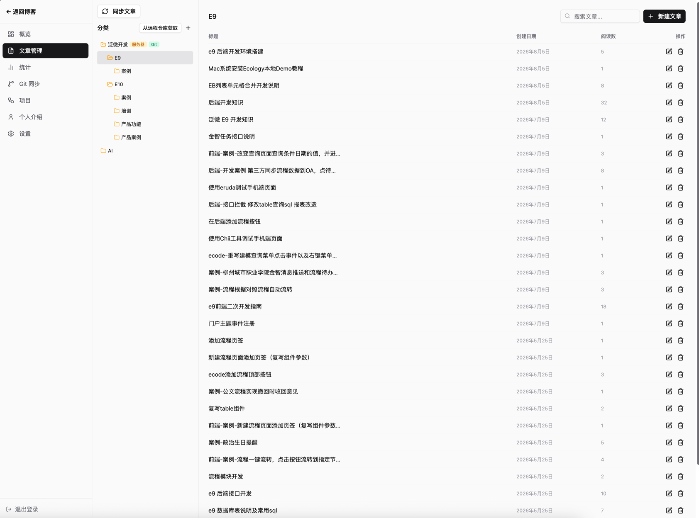
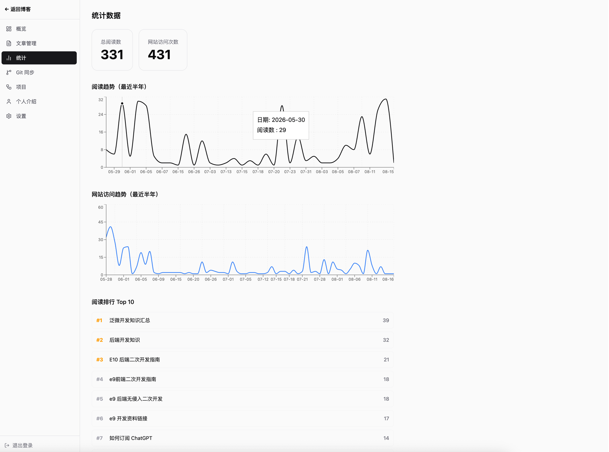

# <center>博客网站
<div style="text-align: center;">个人博客网站，包含文章创建、文章编辑等文章管理功能，支持文章分类和文章搜索，我使用它搭建了我的个人网站</div>

你可以访问我的个人网站查看效果：[https://yaolilin.com](https://yaolilin.com)

## 主要功能
### 首页
#### 文章
你可以在首页展示文章分类，推荐文章（后台可管理推荐文章）和最近文章  



#### 项目展示
你可以在首页展示你的项目，展示的项目可在后台进行管理，点击项目卡片可查看项目介绍以及项目链接。  


#### 个人介绍
在首页可以展示你的个人介绍，可以在后台配置个人介绍的图片，以及使用 Markdown 编辑个人介绍内容。  


### 文章功能
#### 文章分类
在文章分类页面中可以看到文章分类，你可以把文章放到分类中，就像写笔记一样。分类支持配置分类的封面图片。
该页面的下方还列出了最近的文章。



文章分类还提供图标和树形显示两种方式，下面是树形显示效果：  



#### 文章页面
你可以使用 Markdown 编写你的文章，编写文章时支持即时预览编辑。文章显示时可渲染 Markdown 内容，支持代码高亮显示
以及流程图、公式等 Markdown 内容。
文章左侧显示了二级和三级标题，右侧小节显示四级以下标题。

文章显示页面  



文章编写页面，支持即时预览编辑，也就是编辑和预览 Markdown 在同一个页面，编辑即预览，你无需切换预览模式查看文章效果。



#### 文章搜索
可以使用快捷键打开搜索对话框，支持搜索文章标题以及文章内容  



### 明暗主题
支持深色模式和浅色模式切换，可根据时间自动切换主题，或者手动切换主题。  

深色模式主题：  




### 后台管理 
你可以使用管理员密码进入后台页面，在后台页面进行文章管理、网站设置等功能。

#### 文章管理  
你可以在这里管理文章分类和文章，文章支持丛 git 仓库导入，比如你可以从 github 仓库将文章导入到你的博客
网站中，并支持 git 同步，你可以从 git 更新你的博客网站的文章，或者从博客网站推送文章更新到
 git 仓库中。  



#### 统计
在后台统计页面你可以看到网站的访问统计以及文章的阅读统计，你可以在这里了解你的网站的访问情况，你还
可以看到文章的阅读量统计排行，查看哪些文章是受欢迎的。  



### 搜索引擎搜索
网站具有站点地图：`/api/sitemap.xml` ，将该站点地图提交到搜索引擎中即可添加文章索引，让搜索引擎可搜索到
你的文章。网站还支持必应 IndexNow ，每次文章更新都会请求 `IndexNow` 接口，让搜索引擎更新你的文章索引。

## 功能详细说明
查看该文档查看功能的详细设计：[project-development-guide.md](docs/project-development-guide.md)

## 项目结构

```
myblog/
├── frontend/          # React + Vite + shadcn/ui
├── server/            # Spring Boot + Spring Data
├── nginx/             # Nginx 配置
└── docs/              # 文档目录（服务器管理的文件）
```

## 技术栈

### 前端
- **框架**: React 19
- **语言**: TypeScript
- **构建工具**: Vite
- **UI 组件**: shadcn/ui
- **状态管理**: Zustand 或 Context API
- **路由**: React Router
- **Markdown**: react-markdown
- **图表**: recharts
- **主题**: 深色/浅色切换（默认深色）

### 后端
- **框架**: Spring Boot 3.2.0
- **持久层**: Spring Data JPA
- **数据库**: MySQL 8.0
- **缓存**: Redis
- **认证**: JWT (7天有效期)
- **文件监听**: Apache Commons IO
- **Git 集成**: Eclipse JGit

### 基础设施
- **反向代理**: Nginx
- **配置管理**: application.yml

## 快速开始

### 前置要求

1. **Node.js**: >= 22.12.0
2. **npm**: >= 10.0.0

### 后端要求

1. **Java**: JDK 17 或更高
2. **Maven**: 3.6+
3. **MySQL**: 8.0+
4. **Redis**: 6.0+（可选；启用阅读统计去重/缓存相关能力时使用）

### 安装步骤

#### 1. 安装前端依赖

```bash
cd frontend
npm install
```

#### 2. 配置 MySQL

创建数据库：

```sql
CREATE DATABASE blog_db CHARACTER SET utf8mb4 COLLATE utf8mb4_unicode_ci;
```

导入初始化 SQL：

```bash
mysql -u root -p blog_db < server/src/main/resources/schema.sql
```

#### 3. 配置 Redis

确保 Redis 服务正在运行：

```bash
redis-server
```

或使用 Docker：

```bash
docker run -d -p 6379:6379 redis:alpine
```

#### 4. 配置后端

编辑 `server/src/main/resources/application.yml`：

```yaml
server:
  port: 8081
  servlet:
    context-path: /api

spring:
  data:
    redis:
      host: localhost
      port: 6379

app:
  datasource:
    master:
      url: jdbc:mysql://localhost:3306/blog_db?useSSL=false&serverTimezone=UTC
      username: your_mysql_username
      password: your_mysql_password
      driver-class-name: com.mysql.cj.jdbc.Driver
    replica:
      url: jdbc:mysql://localhost:3306/blog_db?useSSL=false&serverTimezone=UTC
      username: your_mysql_username
      password: your_mysql_password
      driver-class-name: com.mysql.cj.jdbc.Driver
  jwt:
    secret: your-secret-key-here
  admin:
    password: $2a$10$MqoKK/5vKGk91GKHOB.2wu0D1LT871T8Kae7jWlAybkE9NbpHKHoq
  site:
    base-url: https://your-domain.com
  index-now:
    enabled: false
    key: 
  docs:
    path: /path/to/your/docs
  image:
    storage:
      path: /path/to/static/images
  attachment:
    storage:
      path: /path/to/static/attachments
  frontend:
    dist:
      path: /path/to/frontend/dist

logging:
  file:
    name: log/app.log
  logback:
    rollingpolicy:
      file-name-pattern: log/app.%d{yyyy-MM-dd}.%i.gz
      max-file-size: 50MB
      max-history: 30
      total-size-cap: 1GB
```

文件路径配置说明：

- `app.docs.path`：服务器管理文档根目录。Git 同步和文件监听会从此目录创建、更新分类和 Markdown 文章；其中的文件可通过 `/api/docs-static/**` 和 `/docs-static/**` 访问。
- `app.image.storage.path`：后台上传图片的存储目录。上传后返回 `/api/static/images/**` 地址；服务器管理文章保存时，会将其中引用的图片迁移到对应文档目录。
- `app.attachment.storage.path`：后台上传附件的存储目录。上传后返回 `/api/static/attachments/**` 地址；服务器管理文章保存时，会将其中引用的附件迁移到对应文档目录。
- `app.frontend.dist.path`：前端 `npm run build` 生成的 `dist` 目录。Nginx 用它作为网站静态根目录；后端生成 SEO 文章页时读取其中的 `index.html` 和 React 入口脚本，IndexNow key 文件也会写入此目录。生产环境默认使用 `/opt/myblog/dist`，可用环境变量 `APP_FRONTEND_DIST_PATH` 覆盖。
- `logging.file.name`：应用日志文件路径。`log/app.log` 是相对路径，按 Java 进程当前工作目录解析；国内生产服务工作目录为 `/opt/myblog`，实际日志文件为 `/opt/myblog/log/app.log`。
- `logging.logback.rollingpolicy.*`：日志滚动策略。归档文件写入相对路径 `log/app.%d{yyyy-MM-dd}.%i.gz`；当前日志达到 50MB 时滚动，保留 30 天，归档总量不超过 1GB。

数据源说明：

- `app.datasource.master`：写库，适合指向主数据库
- `app.datasource.replica`：读库，适合指向当前节点本地只读副本
- 如果当前环境不做主从分离，可以先把 `master` 和 `replica` 都配置成同一个数据库地址

这里保存的是管理员密码的 BCrypt 哈希值，不是明文密码。修改时请先用 `BCryptPasswordEncoder` 重新生成哈希，再替换这里的值。

如果启用 `IndexNow`：

- `app.site.base-url` 填站点公开访问地址，例如 `https://yaolilin.com`
- `app.index-now.key` 填你申请或生成的 key
- 后端启动后会自动在 `app.frontend.dist.path` 根目录写入 `{key}.txt`
- 文章新增、编辑、删除，以及后台“同步文章”完成后，后端会自动向 Bing 的 `IndexNow` 接口提交文章 URL

#### 5. 配置 Nginx

按以下步骤配置 Nginx：

1. 打开 `nginx/blog.conf`，把其中的前端 `root`、图片/附件/文档 `alias` 和后端 `proxy_pass` 路径改为当前机器的实际部署路径。
2. 将配置复制到 Nginx 站点配置目录。以下命令适用于 Debian/Ubuntu 默认目录；其他发行版请改为对应的 `conf.d` 目录。
3. 创建站点启用软链接，使 Nginx 主配置加载该站点配置。
4. 先执行语法检查。只有 `nginx -t` 显示成功后，才重载 Nginx；检查失败时不要重载，应根据报错修正配置后再试。

```bash
# 复制项目中的站点配置
sudo cp nginx/blog.conf /etc/nginx/sites-available/blog

# 启用站点；已存在同名软链接时无需重复执行
sudo ln -s /etc/nginx/sites-available/blog /etc/nginx/sites-enabled/blog

# 检查配置语法和引用路径
sudo nginx -t

# 检查成功后重新加载，不中断现有连接
sudo systemctl reload nginx
```

### 启动项目

#### 启动后端

```bash
cd server
./mvnw spring-boot:run
```

或使用 Maven：

```bash
cd server
mvn spring-boot:run
```

后端将在 `http://localhost:8081/api` 启动。

#### 启动前端

```bash
cd frontend
npm run dev
```

前端将在 `http://localhost:5173` 启动。

开发环境下，Vite 会把 `/api`、`/robots.txt`、`/sitemap.xml`、`/docs-static` 等请求代理到后端地址，默认是 `http://localhost:8081`，因此后端需要先启动并保持运行。

如果你的后端地址不是 `http://localhost:8081`，请修改 `frontend/vite.config.ts` 顶部的 `BACKEND_URL` 常量，把它改成实际的后端地址即可。所有开发代理都会复用这个常量。

### 访问应用

访问 `http://localhost:5173` 查看博客。

默认管理员密码：`admin`

## 网站功能

### 前台功能

- **导航栏**: 多级分类菜单、搜索、主题切换、GitHub 链接
- **欢迎页面**: 座右铭、推荐分类、推荐文章、最近文章
- **文章分类**: 图标模式和树形模式
- **文章页面**: 三栏布局（目录/内容/下级标题）、Markdown 渲染、编辑功能

### 后台功能

- **登录系统**: JWT 认证（7天会话）
- **文章管理**: 分类树、文章列表、CRUD 操作
- **设置页面**: 座右铭配置、附件存储位置配置
- **统计页面**: 总阅读数、趋势图、排行榜
- **Git 同步**: 检测、提交、拉取、冲突处理

### 核心功能

- **图片上传**: 粘贴上传（复制图片 → 粘贴到编辑器）
- **附件管理**: 简化版，像 Obsidian 一样（复制文件 → 粘贴 → 自动上传）
- **文件系统同步**: 双向同步（数据库 ↔ 服务器文件）
- **阅读数统计**: 去重统计，同一浏览器一天只算一次

## 部署说明

### 生产环境部署

推荐服务器目录约定：

- 项目部署根目录：`/opt/myblog`
- 前端静态目录：`/opt/myblog/dist`
- 服务器文档目录：`/opt/myblog/docs`
- 图片目录：`/opt/myblog/static/images`
- 附件目录：`/opt/myblog/static/attachments`
- 后端 JAR：`/opt/myblog/app.jar`
- 后端配置：`/opt/myblog/application.yml`
- 后端日志：`/opt/myblog/log/app.log`
- 后端 API：`http://127.0.0.1:8081/api`

后端 `application.yml`：

```yaml
server:
  port: 8081
  servlet:
    context-path: /api

app:
  datasource:
    master:
      url: jdbc:mysql://127.0.0.1:3306/blog_db?useSSL=false&serverTimezone=UTC
      username: root
      password: your-master-password
      driver-class-name: com.mysql.cj.jdbc.Driver
    replica:
      url: jdbc:mysql://127.0.0.1:3306/blog_db?useSSL=false&serverTimezone=UTC
      username: root
      password: your-replica-password
      driver-class-name: com.mysql.cj.jdbc.Driver
  docs:
    path: /opt/myblog/docs
  image:
    storage:
      path: /opt/myblog/static/images
  attachment:
    storage:
      path: /opt/myblog/static/attachments
  frontend:
    dist:
      path: /opt/myblog/dist
logging:
  file:
    name: log/app.log
  logback:
    rollingpolicy:
      file-name-pattern: log/app.%d{yyyy-MM-dd}.%i.gz
      max-file-size: 50MB
      max-history: 30
      total-size-cap: 1GB
  site:
    base-url: https://your-domain.com
  index-now:
    enabled: false
    key: your-indexnow-key
```

如果部署的是单机版博客，没有单独的从库，可以让 `app.datasource.master` 和 `app.datasource.replica` 指向同一个数据库。

如果部署的是“国内主库 + 国外从库”：

- 国内节点：`master`、`replica` 都可以指向国内数据库，或后续再拆分
- 国外节点：`master` 指向国内主库，`replica` 指向国外本地 MariaDB 从库

#### 1. 构建前端

```bash
cd frontend
npm run build
```

#### 2. 构建后端

```bash
cd server
./mvnw clean package -DskipTests
```

#### 3. 部署前端

将 `frontend/dist` 目录部署到服务器：

```bash
scp -r frontend/dist/* root@<server-ip>:/opt/myblog/dist/
```

#### 4. 部署后端

将 `server/target/*.jar` 部署到服务器：

```bash
scp server/target/myblog-server-1.0.0.jar root@<server-ip>:/opt/myblog/app.jar.new
```

#### 5. 启动后端服务

登录服务器后执行：

```bash
cd /opt/myblog
mv app.jar app.jar.old 2>/dev/null || true
mv app.jar.new app.jar
pkill -f 'java.*app.jar' 2>/dev/null || true
mkdir -p /opt/myblog/log
LANG=C.UTF-8 LC_ALL=C.UTF-8 nohup java -Dfile.encoding=UTF-8 -jar app.jar --spring.config.location=/opt/myblog/application.yml > /opt/myblog/log/nohup.log 2>&1 &
```

或使用 systemd 服务：

```ini
[Unit]
Description=My Blog Server
After=network.target

[Service]
Type=simple
User=root
WorkingDirectory=/opt/myblog
ExecStart=/usr/bin/java -Dfile.encoding=UTF-8 -jar /opt/myblog/app.jar --spring.config.location=/opt/myblog/application.yml
Restart=always
RestartSec=10

[Install]
WantedBy=multi-user.target
```

#### 6. 配置 Nginx

确保 Nginx 配置正确指向生产路径：

- 前端根目录：`root /opt/myblog/dist`
- 后端代理：`proxy_pass http://127.0.0.1:8081`
- 图片目录：`alias /opt/myblog/static/images/`
- 附件目录：`alias /opt/myblog/static/attachments/`
- 文档目录：`alias /opt/myblog/docs/`
- `/api/docs-static/` 和 `/docs-static/` 应直接用 Nginx `alias` 暴露文档目录，避免大文件经后端代理触发 Nginx proxy 临时目录权限或缓冲问题。

```bash
nginx -t
nginx -s reload
```

#### 7. 部署后检查

```bash
ps aux | grep 'java.*app.jar' | grep -v grep
tail -f /opt/myblog/log/app.log
curl -s -o /dev/null -w 'API: HTTP %{http_code}\n' http://127.0.0.1:8081/api/articles
```

### Linux 服务器一键部署脚本

仓库提供通用脚本 `scripts/deploy-linux.sh`，用于在目标 Linux 服务器本机部署当前项目。脚本不包含任何服务器 IP、账号或密码；需要先把仓库代码放到目标服务器，再在服务器上执行。

默认部署到 `/opt/myblog`：

```bash
./scripts/deploy-linux.sh
```

可用环境变量覆盖默认配置：

```bash
APP_ROOT=/srv/myblog \
BACKEND_PORT=8081 \
SERVER_NAME="example.com www.example.com" \
SERVICE_NAME=myblog \
NGINX_CONF=/etc/nginx/conf.d/myblog.conf \
./scripts/deploy-linux.sh
```

常用变量：

| 变量 | 默认值 | 说明 |
| --- | --- | --- |
| `APP_ROOT` | `/opt/myblog` | 部署根目录 |
| `FRONTEND_DIST` | `$APP_ROOT/dist` | 前端静态文件目录 |
| `DOCS_DIR` | `$APP_ROOT/docs` | 管理文档目录 |
| `IMAGE_DIR` | `$APP_ROOT/static/images` | 图片目录 |
| `ATTACHMENT_DIR` | `$APP_ROOT/static/attachments` | 附件目录 |
| `APP_JAR` | `$APP_ROOT/app.jar` | 后端 JAR |
| `APP_CONFIG` | `$APP_ROOT/application.yml` | 后端配置 |
| `APP_LOG` | `$APP_ROOT/log/app.log` | 后端应用日志 |
| `BACKEND_PORT` | `8081` | 后端端口 |
| `BACKEND_CONTEXT_PATH` | `/api` | API 前缀 |
| `SERVICE_NAME` | `myblog` | systemd 服务名 |
| `SERVER_NAME` | `_` | Nginx `server_name` |
| `NGINX_CONF` | `/etc/nginx/conf.d/myblog.conf` | Nginx 配置输出路径 |
| `NGINX_BIN` | `nginx` | Nginx 命令，可改为 `/usr/sbin/aa_nginx` |
| `SKIP_BUILD` | `0` | 设为 `1` 时跳过构建 |
| `SKIP_NGINX` | `0` | 设为 `1` 时不写 Nginx 配置 |
| `SKIP_DOCS` | `0` | 设为 `1` 时不同步 `server/docs` |

脚本会执行：

1. 构建前端和后端。
2. 同步前端、文档、图片、附件到部署目录。
3. 安装或更新 systemd 服务，并使用 `-Dfile.encoding=UTF-8` 启动后端。
4. 生成 Nginx 配置，其中 `/api/docs-static/**` 和 `/docs-static/**` 直接 `alias` 到文档目录，适合大文件下载。
5. 执行 `nginx -t`、reload，并验证本机 API。

## 注意事项

1. **安全性**
   - 生产环境请修改默认密码和 JWT 密钥
   - 确保 MySQL 和 Redis 使用强密码
   - 配置防火墙规则

2. **性能**
   - 使用生产构建版本
   - 配置适当的 JVM 参数
   - 启用 Redis 缓存
   - 配置 Nginx 静态资源缓存

3. **备份**
   - 定期备份数据库
   - 备份文档目录（docs/）
   - 备份静态资源（images/ 和 attachments/）

4. **日志**
   - 检查后端日志：`/opt/myblog/log/app.log`
   - 检查 Nginx 日志：`/var/log/nginx/` 或服务器实际 Nginx 日志目录

## 许可证

MIT License

## 联系方式

如有问题，请联系项目维护者。
